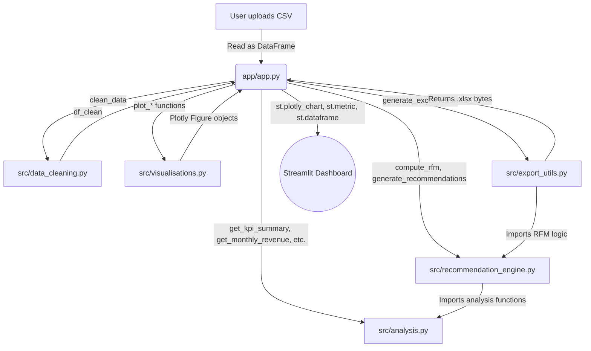

# Architecture & Data Flow

This document explains how the modules of the Online Retail Analytics Platform are structured, how they communicate with each other, and how data flows from a raw CSV upload to real-time visualisations on the Streamlit dashboard.

---

## Module Dependency Map



---

## Module Descriptions

### `app/app.py` — Orchestrator
The central coordinator of the application. Manages session state (`st.session_state`), handles file uploads, routes logic to the correct modules per page, and renders results.

**Three pages:**
| Page | Description |
|------|-------------|
| Data & Upload | CSV upload, validation, data preview |
| Analytics Dashboard | KPIs, revenue trends, products, customers, geography |
| Insights & Actions | Recommendations, What-If Simulator, Excel export |

---

### `src/data_cleaning.py` — Data Cleaning Pipeline
**Entry point:** `clean_data(df: pd.DataFrame) -> pd.DataFrame`

Called immediately after file upload. Normalises the raw dataset:
- Renames columns (`Price → UnitPrice`, `Customer ID → CustomerID`)
- Fills missing CustomerIDs as `"Guest"`
- Flags negative-quantity rows as returns (`IsReturn = True`)
- Removes zero or negative unit prices
- Parses `InvoiceDate` as datetime
- Derives `Revenue = Quantity × UnitPrice`

> All downstream modules operate exclusively on the cleaned DataFrame returned by this function.

---

### `src/analysis.py` — EDA & KPI Functions
Pure functions that compute aggregated statistics from the cleaned dataset.

| Function | Returns |
|----------|---------|
| `get_kpi_summary()` | Top-level KPI dict (revenue, orders, customers, return rate) |
| `get_monthly_revenue()` | Monthly revenue with MoM growth % |
| `get_revenue_by_hour()` | Revenue & transactions by hour of day |
| `get_revenue_by_day_of_week()` | Revenue by weekday |
| `get_top_products()` | Top N products by revenue |
| `get_worst_products()` | Bottom N products by revenue |
| `get_product_return_rate()` | Return rate % per product |
| `get_country_performance()` | Revenue, orders, customers per country |
| `get_customer_lifetime_value()` | Total revenue per identified customer |
| `get_churned_customers()` | Customers inactive for N+ days |
| `get_new_vs_returning_customers()` | Monthly new vs returning customer counts |
| `get_return_summary()` | High-level return/refund statistics |

---

### `src/recommendation_engine.py` — RFM Segmentation & Recommendations
**Part 1 — RFM Computation:** `compute_rfm(df)`, `get_segment_summary(rfm)`

Computes three dimensions for each identified customer and scores them 1–4:
- **Recency (R):** Days since last purchase
- **Frequency (F):** Number of distinct orders
- **Monetary (M):** Total revenue generated

Customers are then assigned to named business segments:

| Segment | Meaning |
|---------|---------|
| Champions | High R, F, M — best customers |
| Loyal Customers | Frequent and recent buyers |
| High Spenders | Large spend, moderate frequency |
| Recent Customers | New buyers, not yet habitual |
| Potential Loyalists | Promising — need nurturing |
| At Risk | Were valuable, now going quiet |
| Needs Attention | Frequent before, now drifting |
| Lost | Long inactive, low value |

**Part 2 — Recommendations:** `generate_recommendations(df)`

Generates up to 7 rule-based business recommendations including:
- Loyalty campaigns for Champions
- Win-back emails for At-Risk customers
- Upsell incentives for Potential Loyalists
- Quality review for high-return-rate products
- Catalogue pruning for low-revenue products
- Timing promotions to peak sales hours
- Cross-sell follow-ups for one-time buyers

Each recommendation includes a type, target segment, action title, message, priority level, and estimated profit impact %.

> This module imports `get_product_return_rate`, `get_worst_products`, `get_revenue_by_hour`, and `get_revenue_by_day_of_week` directly from `analysis.py`.

---

### `src/visualisations.py` — Plotly Chart Generators
Every function accepts a processed DataFrame and returns a `plotly.graph_objects.Figure`, passed directly to `st.plotly_chart()`.

All charts share a unified dark-mode colour palette and layout (`COLORS`, `BASE_LAYOUT`, `PALETTE`).

| Function | Chart Type |
|----------|-----------|
| `plot_monthly_revenue()` | Bar + line combo (revenue & MoM growth) |
| `plot_revenue_by_day_of_week()` | Horizontal bar |
| `plot_revenue_by_hour()` | Dual-axis area chart |
| `plot_top_products()` | Horizontal bar |
| `plot_product_return_rates()` | Horizontal bar with threshold line |
| `plot_rfm_segments()` | Bubble chart (Recency vs Revenue) |
| `plot_segment_revenue_share()` | Donut chart |
| `plot_clv_distribution()` | Histogram |
| `plot_new_vs_returning()` | Stacked bar |
| `plot_country_revenue()` | Choropleth world map |
| `plot_top_countries_bar()` | Horizontal bar |
| `format_kpi_cards()` | Returns display-ready list for `st.metric` |

---

### `src/export_utils.py` — Excel Report Generator
**Entry point:** `generate_excel_report(df, kpis, recs, projections) -> bytes`

Generates an in-memory, multi-sheet styled Excel workbook:

| Sheet | Content |
|-------|---------|
| Executive Summary | Historical KPIs + What-If simulator projections |
| Customer Segments | RFM segment breakdown table |
| Actionable Recommendations | Full recommendation list with priority colouring |

Imports RFM logic from `recommendation_engine.py` to populate the segments sheet.

---

### `tests/test_analysis.py` — Automated Test Suite
29 unit tests organised in 6 test classes. Run with `pytest`.

| Class | Tests |
|-------|-------|
| `TestCleanData` | 8 tests — cleaning steps & column creation |
| `TestKPISummary` | 6 tests — KPI values & types |
| `TestReturnSummary` | 3 tests — return statistics |
| `TestRFM` | 4 tests — RFM columns, guest exclusion, segment summary |
| `TestRecommendations` | 5 tests — structure, priorities, sort order |
| `TestMonthlyRevenue` | 3 tests — output shape & columns |

---

## Real-Time Execution Flow

```
1.  User uploads CSV or loads default dataset
2.  app.py  →  data_cleaning.py  →  df_clean stored in session_state
3.  User opens "Analytics Dashboard"
4.  app.py  →  analysis.py  →  KPIs, monthly stats, product & customer tables
5.  app.py  →  visualisations.py  →  Plotly figures rendered on screen
6.  User opens "Insights & Actions"
7.  app.py  →  recommendation_engine.py  →  RFM scores, segments, recommendations
8.  User adjusts What-If simulator sliders  →  projections recalculate instantly
9.  User clicks "Download Excel Report"
10. app.py  →  export_utils.py  →  .xlsx file streamed to browser
```

> The entire pipeline runs **100% in memory** — no database or external services required. This guarantees sub-second refresh times and fully offline operation.
